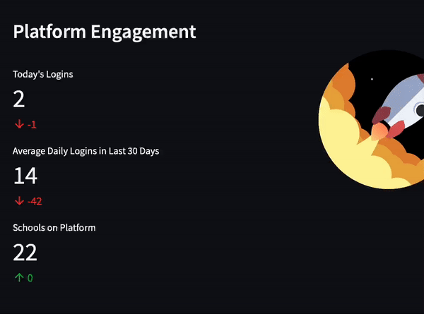

# dashboard
## automated refreshing dashboard with data stream deployed on ec2
this repo will be cloned on an ec2 instance and glue.py will be scheduled to run x times per day while elastikdashboard.py will run once and be left running as a constant process on the vm that keeps the app up

the next big task is to clean up the code, add more dynamic reading and solve final error

* query.txt files are SQL queries
* this should all run fine on 1gb memory until more data is used
* access key should not be made public

Heroku, owned by sales force, is an app hosting platform which can be found at www.heroku.com. I have created an account on Heroku but another can just as easily be made with very little set-up to have this process working on another if need be. I have created a web job on heroku and made the setup and Procfiles as needed, I will recommend a tutorial about this later as new users should be comfortable with this service. Heroku works by being given a git repository and takes shell commands and is able to host your app at a URL to be accessible via browser. It is also possible to choose whatever URL name you wish and remove ‘herokuapp’ from it if you have your own domain.

https://elastikdash.herokuapp.com/

Found at the following repository is the dashboard.py file which can be ran on heroku.

https://github.com/elastikdatateam/dashboard

What should also be noted is that there are txt files containing SQL queries, and data-helpers which help transform resulting csv files into the formatted dataframes needed for displaying.

The first important python script is the glue.py file. There is a function in this script called query which takes in a sql query and an output location (the bucket) using boto3 (package you should become familiar with). There is another function which updates the data in s3 by first deleting any if need be and then calling the prior function - a key reason why I decided to do this and not use Glue. Keep in mind that for any script related to aws to run you need to create a client using your AWS keys, and keep these keys out of the code - I have put them as heroku environment variables for the dashboard and for the other scripts I have read them from a local file saved on EC2.

This repository has been cloned to the EC2 instance and the glue.py is scheduled to run on there as a cron job. Any data-code updates would need to be pulled on there. Any dash-code changes will need to be pushed to heroku. This job will run a few minutes before the heroku restart runs which gives the new information on the dashboard website. You must log in to heroku in order to push restarts to your app as well as create a new ‘herkou’ git remote, and it is recommended to be logged into the github account elsewhere for making fast and easy pushes. There is still work to be done improving the code as it was written pretty quickly, one area for improvement is to remove waits and instead when reading into the dashboard file check the csv columns as the decider for hashmap assignment rather than datetime modified.

This process has currently been set up such that a user will refresh the dashboard site to see updated new data from dynamodb every morning at 10:38 and 04:04 UTC. I would recommend users to be able to use linux and have knowledge of some ubuntu commands as this is all in-terminal. Additionally, the site currently requires log-ins to view and these have not yet been hidden.

The EC2 instance is always on and uses very little credits
Heroku account is not verified so you will see ‘insecure’ and they are apparently cancelling free dynos by the end of November
